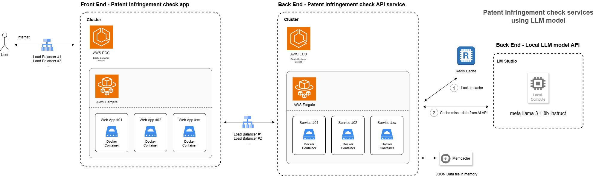

## Assignment

This repository contains two separate projects:

1. **Back End**: Developed in Python using the FastAPI framework.
2. **Front End**: A web application built with Next.js and Tailwind CSS.

A demo section is included at the end of this README.

## Task : Mini Patent Infringement Check App

### Core Functionality
- Input a patent ID and a company name.
- Run a patent infringement check against the specified company.
- Return the top two infringing products of the company along with detailed explanations of why these products potentially infringe the patent, including specific claims at issue.

## Server Architecture

The server architecture setup is outlined below, designed with the following considerations:

- **Traffic Distribution**: Utilizes AWS ECS (or EKS) with Fargate to distribute traffic evenly and optimize resource utilization.
- **Redis Caching for OpenAI LLM Model Check**: Implements Redis to cache frequently requested patent infringement check data, reducing OpenAI API calls. This enhances the performance and scalability of the application by serving cached responses when possible.

Currently, for demonstration purposes, the projects are deployed on a single server (AWS EC2 t2.micro).



## Back End

The back end of this project is developed using Python's FastAPI framework and manages the following core functionalities:

#### Features
- Search for patent IDs and their titles.
- Search for company names.
- Perform patent infringement checks using OpenAI's LLM model (**Meta-Llama-3.1-8B-Instruct**).
- Cache results using Redis to improve performance.
- Load JSON files into memory for fast processing.


## Project Structure
```plaintext 
pal-back-end/ 
├── app/ 
│ ├── core/ 
│ │ ├── data_loader.py           # Reads and parses patent and company product data from JSON files
│ │ └── singleton_data.py        # Loads and caches JSON data in memory at startup for efficient access throughout the app lifecycle.
│ ├── routers/ 
│ │ └── patent_routes.py         # Defines API endpoints for searching patents, companies, and performing patent infringement checks.
│ ├── schemas/
│ │ └── patents.py               # Defines Pydantic schemas with custom validation rules for patent and company-related requests and responses.
│ ├── services/
│ │ ├── company_service.py       # Implements search logic for companies stored in memory, including partial and exact matches.
│ │ └── patent_service.py        # Implements search logic for patents stored in memory, including partial and exact matches.
│ ├── utils/
│ │    ├── llm.py                # Implements logic to interact with OpenAI's LLM for patent infringement checks, including API handling and result processing.
│ │    └── redis_cache.py        # Provides Redis connection configuration and caching utilities, with support for configurable settings via environment variables.
│ ├── config.py                  # Configuration settings 
│ └── main.py                    # Main FastAPI app entry point 
├── data_files/ 
│ ├── company_products.json      # JSON companies data file  
│ └── patents.json               # JSON patents data file
├── logs/                        
├── .env                         # Environment variables file 
├── Dockerfile                   # Docker configuration file to containerize the application for deployment.
├── requirements.txt             # Project dependencies 
└── run.sh                       # Sets up the environment and launches the FastAPI server.
```

## Installation

1. Clone the repository:
   ```bash
   git clone https://github.com/engee-nl/patly.git
   cd pal-back-end
   ```

2. Create a virtual environment and activate it:
   ```bash
   python -m venv venv
   source venv/bin/activate
   ```

3. Install the required packages:
   ```bash
   pip install -r app/requirements.txt
   ```

4. Create a `.env` file with your environment variables:
   ```plaintext
   DATABASE_URL=""
   OPEN_AI_URL="http://111.118.43.201:1234/v1"
   REDIS_URL="ec2-43-201-34-212.ap-northeast-2.compute.amazonaws.com"
   REDIS_PORT=6379
   REDIS_PASSWORD="tLscdw35xmM1kSB"
   ```

## Running the Application

To run the FastAPI application, use the following command:

```bash
uvicorn app.main:app --host 0.0.0.0 --port 8200 --reload --timeout-keep-alive 180
```

## Using Docker

This project can be run using Docker. Follow the steps below:

1. **Build the Docker image**:
   Build the Docker image: Navigate to the root of the project directory (where the Dockerfile is located) and run the following command:

   ```
   docker build -t pal-back-end-image .
   ```

2. **Run the Docker container**:
   After the image is built, you can run the container using the following command:

   ```
   docker run -d --name pal-back-end-service -p 8200:8200 pal-back-end-image
   ```

3. **Access the application**:
   Once the container is running, you can access the application at http://localhost:8200/docs to interact with the API documentation.

4. **Stop the container**:
   To stop the container, use the following command:

   ```
   docker stop pal-back-end-service
   ```

5. **Remove the container (optional)**:
   If you want to remove the container after stopping it, run:

   ```
   docker rm pal-back-end-service
   ```

## API Endpoints

- **Get Patent information by ID**: `GET /api/v1/patents/{patent_id}`
- **Search Patents (partial and exact matches)**: `POST /api/v1/patents/search`
- **Search Companies (partial and exact matches)**: `POST /api/v1/companies/search`
- **Check Patent Infringement against a company**: `POST /api/v1/patents/check-infringement`

## Technologies Used

- **Python**: 3.8 or higher
- **FastAPI**: For building the web API
- **Pydantic**: For data validation and settings management
- **Uvicorn**: ASGI server for running the application
- **JSON**: For storing image metadata

## To Do - Best practices

***
***
***


## Front End
This project is a simple patent infringement check application using **Next.js** with **TypeScript** and **Tailwind CSS**. It allows users to:
1. Search a patent (for autocomplete)
2. Search a company (for autocomplete)
3. Check patent infringement and view a detailed report.
4. Save or delete the report in local storage.

The front end communicates with the backend API to perform the patent checking.

## Features

- **Tailwind CSS for Styling**: The UI is styled with Tailwind CSS for a modern and responsive design.


## Project Structure
```plaintext 
pal-front-end/ 
├── app/
│   ├── about/
│   │   └── page.tsx                      # About test page.
│   ├── components/
│   │   ├── AutocompleteInputs.tsx        # Component for autocomplete functionality in the input fields for Patent ID and Company Name.
│   │   ├── Notification.tsx              # Component to display success and error notifications to the user.
│   │   └── Report.tsx                    # Component to render the patent infringement report after the check is completed.
│   ├── controller/
│   ├── fonts/
│   │   ├── GeistMonoVF.woff              # Variable font file for monospace styling.
│   │   └── GeistVF.woff                  # Variable font file for standard text styling.
│   ├── service/
│   │   └── infringementService.ts        # Service handling API requests for patent infringement checks. 
│   ├── types/
│   │   └── infringementReport.ts         # Type definitions for the patent infringement report structure (TypeScript).
│   ├── favicon.ico                       # Application's favicon.
│   ├── globals.css                       # Global CSS file for styling defaults across the application.
│   ├── layout.tsx                        # Layout component defining the common structure of the application pages.
│   └── page.tsx
├── public/                               # Static files
├── image_list.json                       # Main entry page component.
├── .env.local                            # Environment variables for the local development setup (e.g., API endpoints, keys).
├── .env.production                       # Environment variables for the production setup.
├── Dockerfile                            # Docker configuration file to containerize the application for deployment.
├── .eslintrc.json
├── .gitignore
├── next.config.mjs
├── package.json
├── postcss.config.mjs
├── README.md
├── tailwind.config.ts
└── tsconfig.json
```
## How to Run the Project

### Prerequisites

- Node.js
- npm or yarn package manager

### Installation Steps

1. Clone the repository:
   ```bash
   git clone https://github.com/engee-nl/patly.git
   cd pal-front-end
   ```

2. Install dependencies:
   ```bash
   npm install
   ```

3. Set up environment variables:
   Create a `.env` file in the root directory and add the API host.
   ```
   NEXT_PUBLIC_API_HOST=http://43.201.34.212:8200/api/v1
   ```

4. Run the development server:
   ```bash
   npm run dev
   ```

5. Open your browser and navigate to:
   ```
   http://localhost:3000
   ```


## Using Docker

This project can be run using Docker. Follow the steps below:

1. **Build the Docker image**:
   Build the Docker image: Navigate to the root of the project directory (where the Dockerfile is located) and run the following command:

   ```
   docker build -t pal-front-end-image .
   ```

2. **Run the Docker container**:
   After the image is built, you can run the container using the following command:

   ```
   docker run -d --name pal-front-end-app -p 8100:3000 pal-front-end-image
   ```

3. **Access the application**:
   Once the container is running, you can access the application at http://localhost:8100 to interact with the website.

4. **Stop the container**:
   To stop the container, use the following command:

   ```
   docker stop pal-front-end-app
   ```

5. **Remove the container (optional)**:
   If you want to remove the container after stopping it, run:

   ```
   docker rm pal-front-end-app
   ```

## Technologies Used

- **Next.js**: React framework for building server-side rendered applications.
- **TypeScript**: Strongly-typed JavaScript for better code quality and maintainability.
- **Tailwind CSS**: Utility-first CSS framework for building responsive and modern UIs.
- **React Hooks**: For managing state and lifecycle methods in functional components.

## Demo
- **Back End Service**:        http://43.201.34.212:8200/docs
- **Front End Web App**:       http://43.201.34.212:8100
